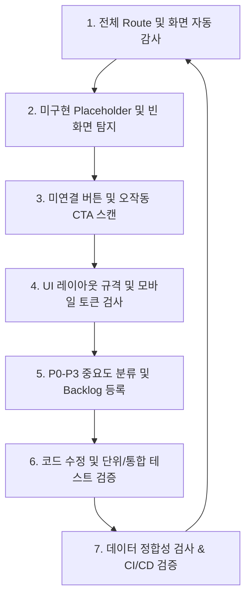

# 지속적 제품 품질 관리 목표 및 루프 (docs/32)

본 문서는 Fuel Arena 플랫폼의 출시 신뢰성을 영구적으로 유지하기 위한 **지속적인 제품 품질 루프(Continuous Quality Loop)**의 원칙과 실무 방식을 규정합니다.

---

## 1. 제품 품질 감사 루프 (Quality Loop)

Fuel Arena는 다음 단계의 지속적 품질 피드백 루프를 반복 수행하여 앱과 데이터의 품질을 유지합니다.

1. **전체 Route Audit**: 모든 URL 및 네비게이션 경로가 올바른 뷰에 매핑되어 있으며 에러 없이 렌더링되는지 스크립트로 상시 검사합니다.
2. **빈 화면 & Placeholder 탐지**: 사용자에게 빈 흰색 화면이나 템플릿(Lorem Ipsum 등)이 그대로 노출되지 않도록 사용자 향(User-facing) 코드에 포함된 금지 키워드를 스캔합니다.
3. **미연결 버튼 탐지**: 동작하지 않는 비활성 버튼이나 CTA(Call-to-Action)에 대해 적절한 Toast 안내 또는 기능 연결을 수행합니다.
4. **UI 스케일 및 모바일 토큰 검증**: 모바일 환경(최대 430px 너비)에서 텍스트 오버플로우나 레이아웃 깨짐이 발생하는지 점검합니다.
5. **Backlog 분류**: 검출된 이슈들을 `docs/33_quality_backlog.md`에 등재하고 우선순위별로 주간/시즌별 정리를 시행합니다.

---

## 2. 사용자 UI 내 금지 키워드 규제

앱이 런칭 단계에서 완성도 높은 인상을 줄 수 있도록, **사용자가 직접 마주하는 화면 및 문구에 아래 키워드가 발견될 경우 빌드 파이프라인(CI)을 실패 처리**합니다.

* **금지어 목록**:
  - `TODO`, `FIXME` (개발 주석이 UI 상에 하드코딩되는 현상 방지)
  - `Placeholder`, `Lorem Ipsum`
  - `준비 중`, `Coming soon`, `임시 화면`, `샘플 화면`
  - `빈 화면`, `test only`

*※ 단, 개발 문서나 README, 혹은 소스 코드 내의 주석은 허용하되, 다트 뷰 코드의 `Text(...)` 나 `hintText` 등 렌더링되는 문자열에 사용되는 것을 전면 금지합니다.*
