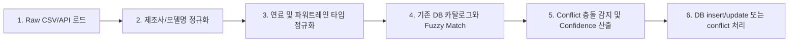

# 파워트레인 데이터 임포트 파이프라인 설계 (docs/34)

본 문서는 외부 공공 데이터(한국에너지공단 등) 및 제조사 배포 제원을 안전하고 정교하게 수집·정규화·매칭 및 반영하기 위한 **임포트 파이프라인(Import Pipeline)**의 아키텍처와 단계별 실행 방식을 정의합니다.

---

## 1. 파이프라인 전체 프로세스

1. **Source 등록**: `vehicle_data_sources` 테이블에 원본 출처 명칭, 수집 경로, 라이선스 정책 등을 먼저 등록합니다.
2. **Raw Row 로드**: KEA 공인 연비 CSV 파일 또는 제조사 제원 CSV 템플릿 파일에서 한 행씩 레코드를 읽어옵니다.
3. **제조사/모델명 정규화**: `현대자동차` -> `현대`, `BMW 320i LCI` -> `3시리즈` 등 미리 구성된 맵을 거쳐 카탈로그 표준명으로 정규화합니다.
4. **연료/파워트레인 정규화**: 한글/영문 혼재된 연료 방식을 표준 코드(gasoline, diesel, hybrid, electric, lpg, hydrogen 등)로 정규화합니다.
5. **Fuzzy Match & Confidence 계산**:
   - 제조사, 모델, 연식, 변속기, 구동방식, 배기량이 완전히 일치하면 **Exact Match (Confidence = 1.0)**
   - 트림명이나 세부 명이 일부 다를 경우 유사도 점수를 산출합니다. **Confidence < 0.8** 일 경우 자동으로 `pending_review` 상태로 임포트됩니다.
6. **Conflict 해결**:
   - 이미 존재하는 변종 데이터와 임포트할 데이터 간의 제원(예: 연비, 배터리 용량 등)이 다를 경우 기존 데이터를 강제로 덮어쓰지 않고 `vehicle_catalog_conflicts` 테이블에 격리 저장하며, 관리자 검수 대기 상태(`open`)로 둡니다.

---

## 2. 임포트 모드 및 환경변수

파이프라인은 CLI 툴 형태로 구동되며, 로컬에서 CSV 파일을 처리하는 방식으로도 동작합니다.

* **환경변수 설정**:
  - `VEHICLE_CATALOG_IMPORT_MODE=local_csv` (또는 `api`를 이용한 공공 데이터 포털 싱크)
  - `DATA_GO_KR_SERVICE_KEY=...` (공공데이터포털 API 연동용 디코드 키)
